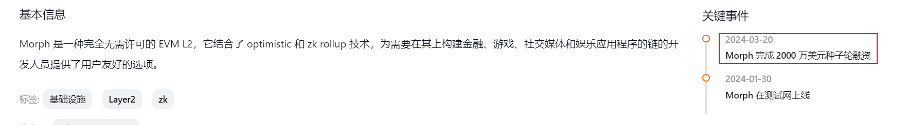
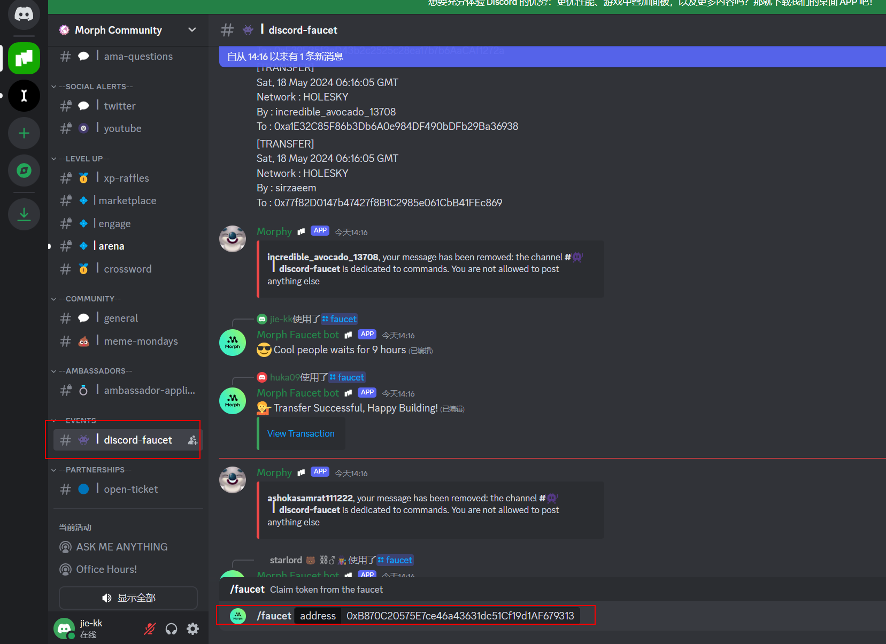
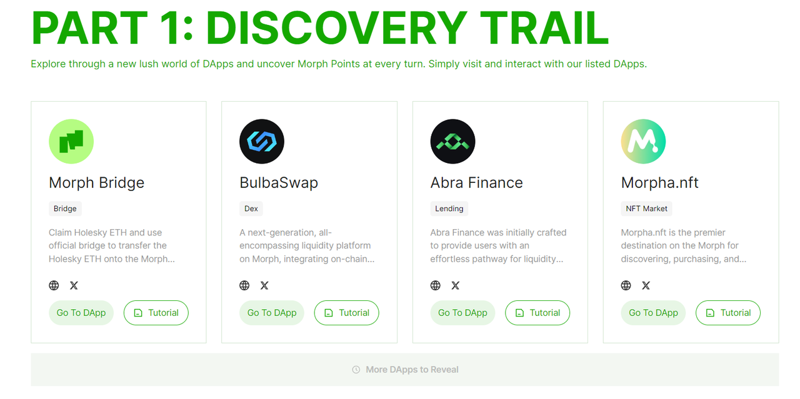
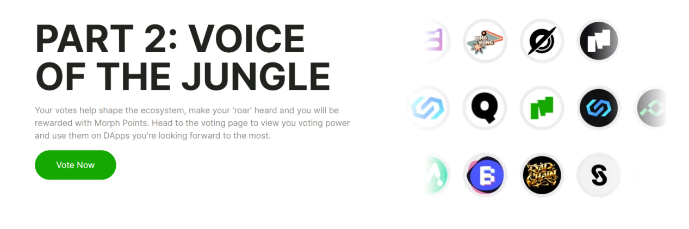
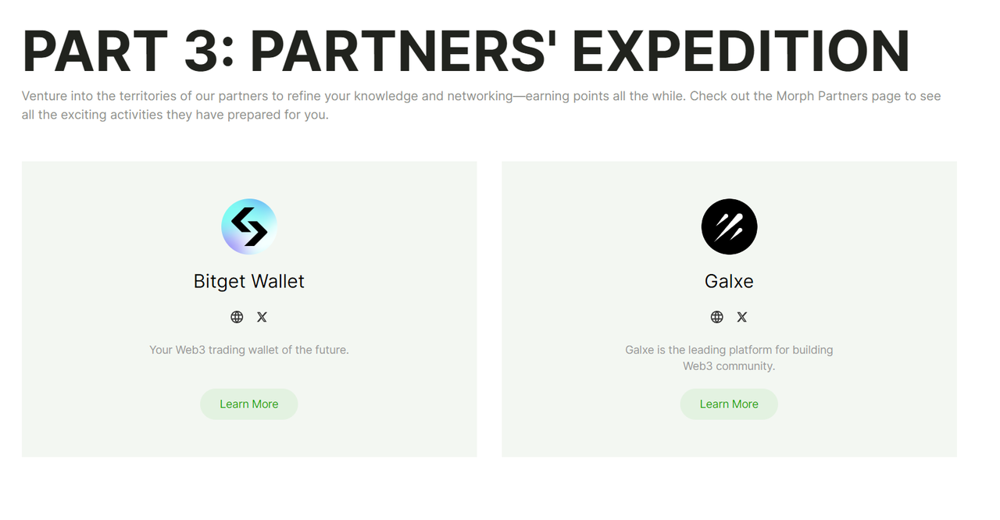

Morph空投教程
========================

## 流程

1. 添加测试网
2. 领取测试币
3. 交互

## 项目信息
Morph是Optimistic zkEVM的L2扩容方案，采用了模块化的设计，对于L2的生态发展有巨大帮助，前景广阔。

## 添加钱包

在chrome扩展商店安装狐狸钱包
https://chromewebstore.google.com/detail/metamask/nkbihfbeogaeaoehlefnkodbefgpgknn?hl=zh-CN&utm_source=ext_sidebar

## 添加测试网
https://chainlist.org/?search=holesky&testnets=true

## 领取测试以太币
在以下几个链接领取测试以太币【推荐第二个。需要在主站存入0.001个以太币】
https://stakely.io/en/faucet/ethereum-holesky-testnet-eth
https://faucet.quicknode.com/ethereum/holesky
https://holesky-faucet.pk910.de/

## 领取测试USDT
进入Discord：https://discord.com/invite/f3Wh6ZK6XC

在#|discord-faucet频道 输入  /faucet + Holesky地址

Ethereum Holesky USDT合约地址: "0xD6e9Cd5ef382b0830653d1b2007D5Ca6987FaA26"

Morph Holesky USDT合约地址 "0x9E12AD42c4E4d2acFBADE01a96446e48e6764B98"

## 等待钱包到账

a few moments later...

## 交互
进入Morph交互网页:https://www.morphl2.io/points/genesis_jungle/

### Dapp交互

### 投票

### 合作方任务
