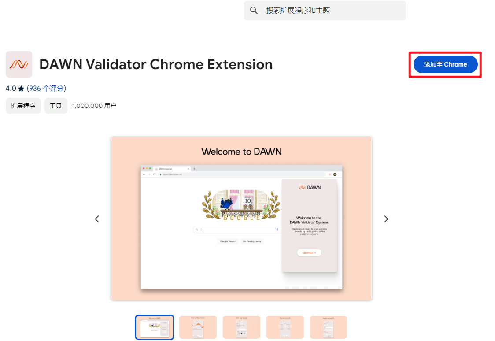

Projects
============

# 须知

大多数web3项目是基于浏览器的应用，所以最好准备一台电脑，可以方便操作项目。

为了更好的扩展性和集成性，web3项目会使用浏览器扩展程序执行项目的操作。

钱包作为web3世界的入口，是必不可少的应用，在浏览器上，钱包是以浏览器扩展程序的形式存在的。

对于钱包而言，使用[欧意钱包](https://chromewebstore.google.com/detail/%E6%AC%A7%E6%98%93-web3-%E9%92%B1%E5%8C%85/mcohilncbfahbmgdjkbpemcciiolgcge?utm_source=ext_app_menu ":target=_blank")足以应付大多数项目。

如果web3项目需要使用其他钱包，可根据需要自行下载。

## 下载[欧意钱包](https://chromewebstore.google.com/detail/%E6%AC%A7%E6%98%93-web3-%E9%92%B1%E5%8C%85/mcohilncbfahbmgdjkbpemcciiolgcge?utm_source=ext_app_menu ":target=_blank")

 

 

 

 

 

 

# Depin(去中心化基础设施)

Depin项目都是挂机项目，只要基础工作完成了，把电脑正常打开挂机，后续就不需要人操心了，属于比较简单的项目。

## Nodepay(2024-12-28)

### 教程

1、[Chrome浏览器](https://chromewebstore.google.com/detail/nodepay-extension/lgmpfmgeabnnlemejacfljbmonaomfmm?hl=zh-CN&utm_source=ext_sidebar ":target=_blank")添加扩展

 

2、[注册页面](https://app.nodepay.ai/register?ref=hSq49WoQ9h6EhDn ":target=_blank")完成注册

 

3、链接solana钱包

3.1 复制solana地址

 

3.2 链接solana账户

 

4、完成人类证明

5、每日积分领取

6、日常挂机

## Dawn(2024-12-28)

### 教程

1、[Chrome浏览器](https://chromewebstore.google.com/detail/dawn-validator-chrome-ext/fpdkjdnhkakefebpekbdhillbhonfjjp?hl=zh-CN&utm_source=ext_sidebar ":target=_blank")添加扩展

2、注册(邀请码：0kp94a8b)

 

3、邮箱验证

 

4、登录

 

5、完成任务（都是假任务，完成点击即可）

 

6、日常挂机

 

